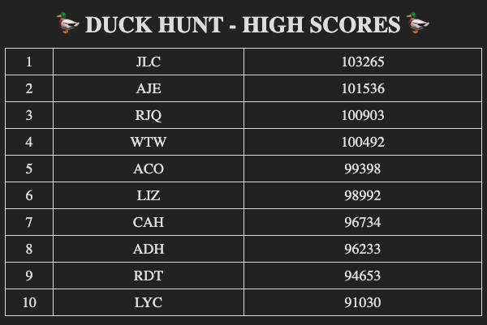

# Duck Hunt

## Instructions

In the initial commit to this project, you have been provided with a set of user high scores as a JavaScript object. Your task is to implement a Pug driven site that will display the scores in a very simple format as in the fancier example shown in the screenshot below. Styling is not part of this effort. This exercise will be completed in class.

